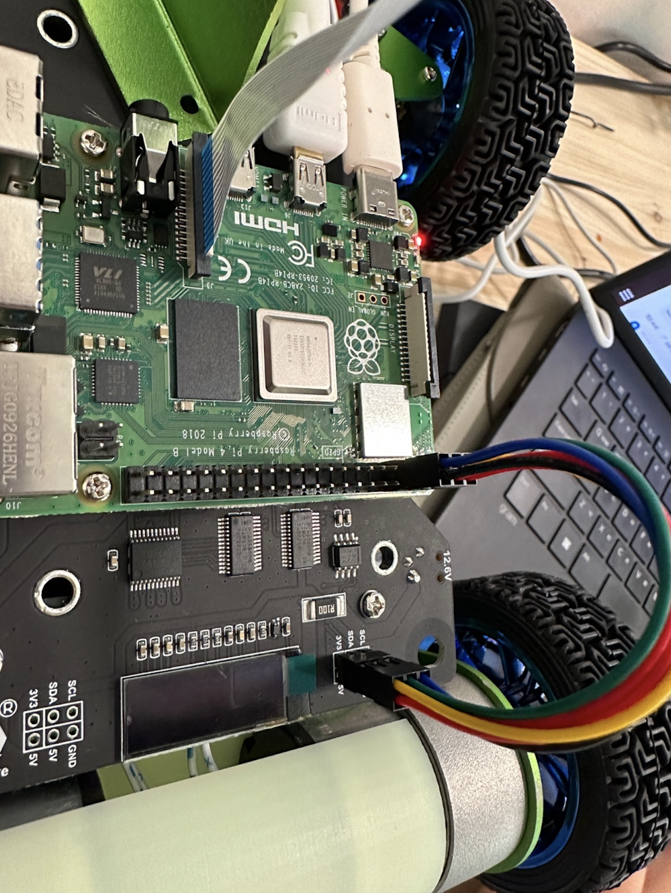

# **DES Project - PiRacer Assembly**

## Result

## Project Description

The PiRacer is a compact, single-board computer-based racing car that uses the Raspberry Pi computer as its brain. In this project, we will assemble and test PiRacers.
 

## Project Requirements

* Raspberry Pi computer
* Motors and wheels
* Batteries and battery holder
* Soldering iron and soldering wire
* Multimeter
* Python programming language
* Any other necessary components, as specified in the kit guide  
 

## Project Usage

1. Follow the Hardwaresetting. Check raspberrypi GPIO map.
2. Follow the Softwaresetting.
3. Try examples code.
 

